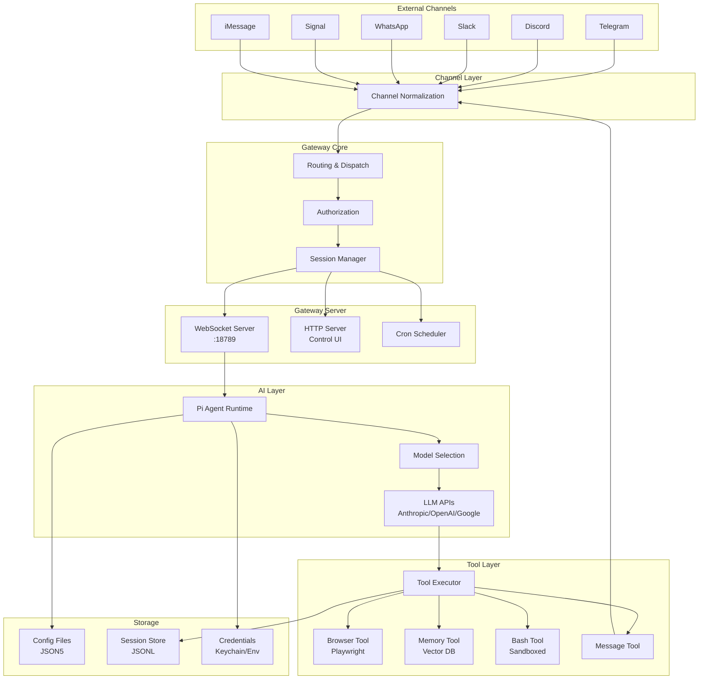
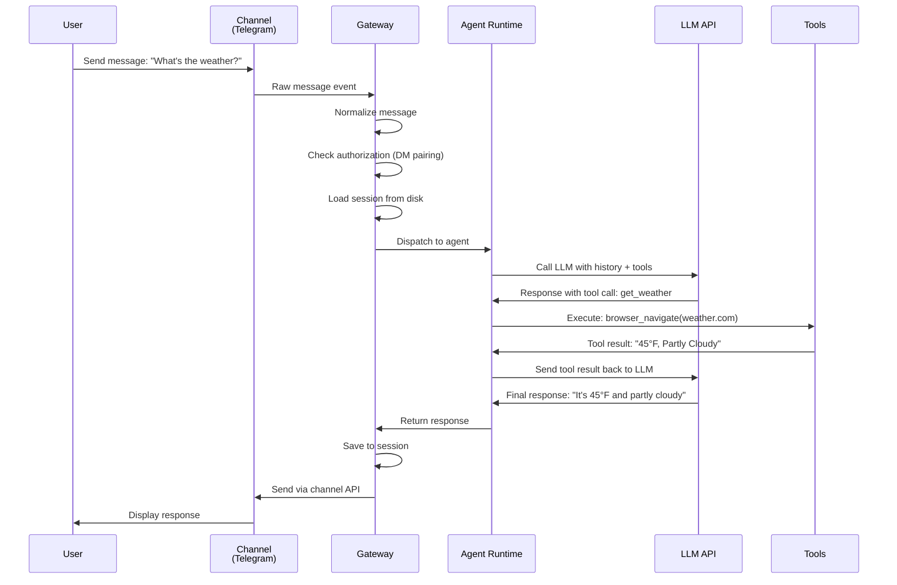
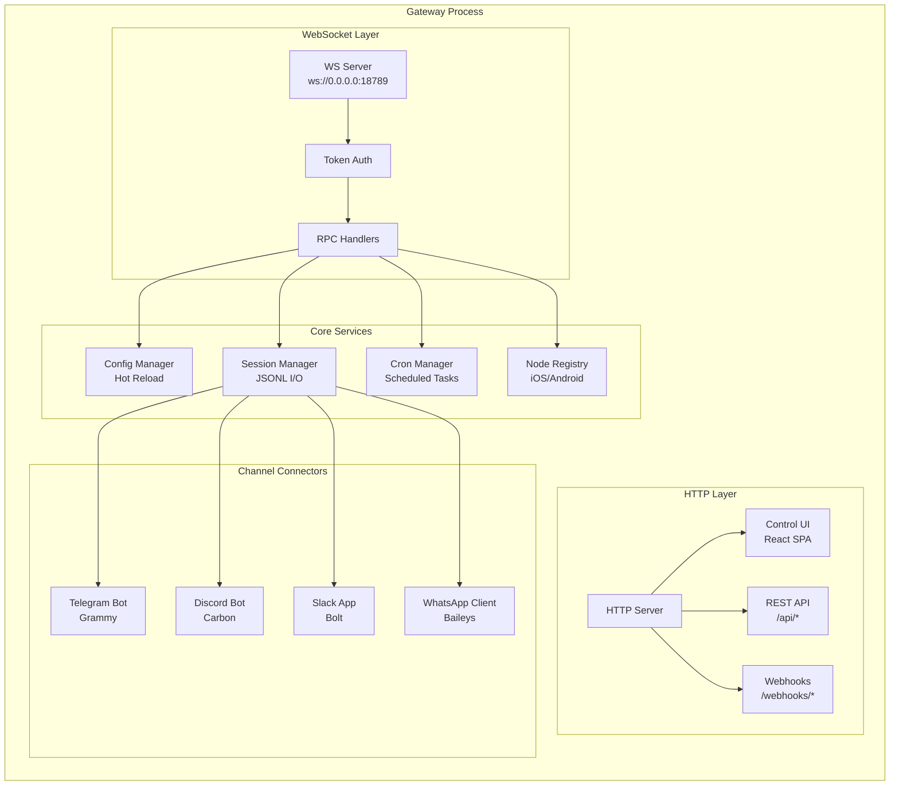
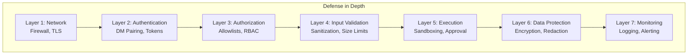
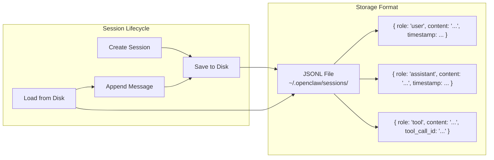
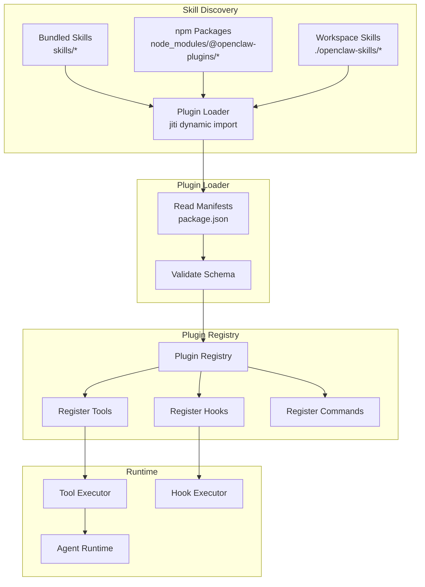
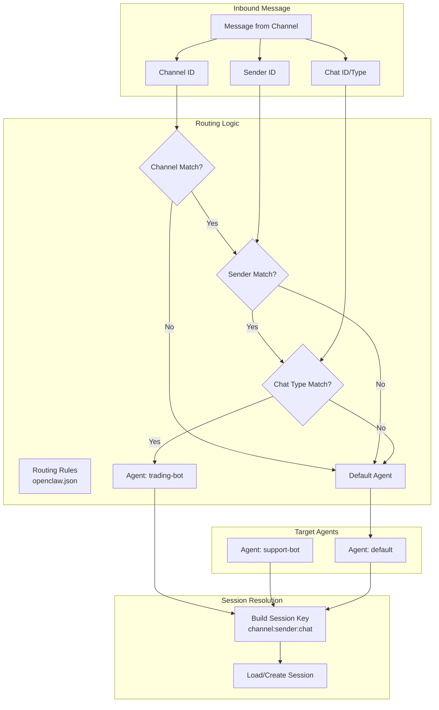
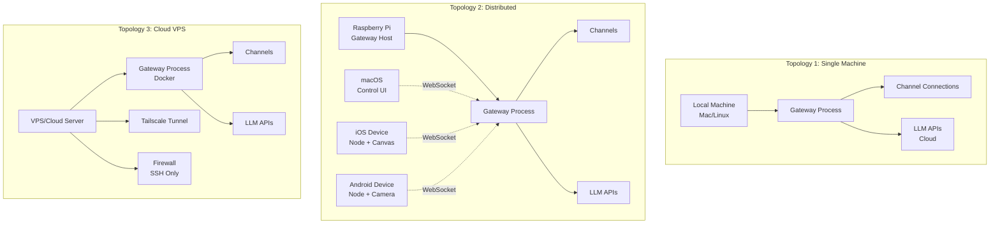

# OpenClaw Architecture Diagrams

This document contains detailed architectural diagrams for the OpenClaw system.

## System Architecture Overview



## Message Flow Sequence



## Gateway Architecture Detail



## Agent Runtime Components

```mermaid
graph TB
    subgraph "Pi Agent Runtime"
        subgraph "Input Processing"
            Input[Message Input]
            History[Load History]
            Context[Build Context]
            Input --> History
            History --> Context
        end
        
        subgraph "Model Layer"
            Select[Model Selection]
            Auth[Auth Resolver]
            Failover[Failover Logic]
            Context --> Select
            Select --> Auth
            Select --> Failover
        end
        
        subgraph "LLM Integration"
            API[LLM API Client]
            Stream[Stream Handler]
            Parse[Response Parser]
            Auth --> API
            API --> Stream
            Stream --> Parse
        end
        
        subgraph "Tool Execution"
            ToolDec[Tool Decision]
            ToolExec[Tool Executor]
            ToolRes[Result Handler]
            Parse --> ToolDec
            ToolDec --> ToolExec
            ToolExec --> ToolRes
        end
        
        subgraph "Output"
            Format[Format Response]
            Save[Save to Session]
            Deliver[Deliver to Channel]
            ToolRes --> Format
            Format --> Save
            Format --> Deliver
        end
    end
```



## Security Layers



## Data Flow: Session Persistence



## Skill/Plugin Architecture



## Multi-Channel Routing



## Deployment Topologies



---

## ASCII Art Diagrams (for terminals)

### High-Level Architecture

```
┌─────────────────────────────────────────────────────────────────┐
│                     MESSAGING CHANNELS                          │
│  WhatsApp │ Telegram │ Discord │ Slack │ Signal │ iMessage │... │
└─────────────────────┬───────────────────────────────────────────┘
                      │
                      ▼
┌─────────────────────────────────────────────────────────────────┐
│                   CHANNEL NORMALIZATION                         │
└─────────────────────┬───────────────────────────────────────────┘
                      │
                      ▼
┌─────────────────────────────────────────────────────────────────┐
│                ROUTING & AUTHORIZATION                          │
│   • DM Pairing Check                                            │
│   • Allowlist Verification                                      │
│   • Agent Assignment                                            │
│   • Session Key Building                                        │
└─────────────────────┬───────────────────────────────────────────┘
                      │
                      ▼
┌─────────────────────────────────────────────────────────────────┐
│                   GATEWAY (Control Plane)                       │
│                ws://127.0.0.1:18789                             │
│                                                                  │
│  ┌──────────────┐  ┌──────────────┐  ┌────────────────┐       │
│  │ WS Server    │  │ HTTP Server  │  │ Cron Scheduler │       │
│  │ (RPC)        │  │ (Control UI) │  │ (Tasks)        │       │
│  └──────────────┘  └──────────────┘  └────────────────┘       │
│                                                                  │
│  ┌────────────────────────────────────────────────────┐        │
│  │           Session Manager (JSONL Store)             │        │
│  └────────────────────────────────────────────────────┘        │
└─────────────────────┬───────────────────────────────────────────┘
                      │
                      ▼
┌─────────────────────────────────────────────────────────────────┐
│                  PI AGENT RUNTIME (RPC Mode)                    │
│                                                                  │
│  ┌────────────────┐  ┌────────────────┐  ┌─────────────────┐  │
│  │ Model Selection│  │ LLM API Client │  │ Tool Executor   │  │
│  │ & Failover     │  │ (Streaming)    │  │ (20+ tools)     │  │
│  └────────────────┘  └────────────────┘  └─────────────────┘  │
└─────────────────────┬───────────────────────────────────────────┘
                      │
                      ▼
┌─────────────────────────────────────────────────────────────────┐
│                   EXTERNAL SERVICES                             │
│                                                                  │
│  ┌──────────────┐  ┌──────────────┐  ┌──────────────┐         │
│  │ Anthropic    │  │ OpenAI       │  │ Google       │         │
│  │ Claude API   │  │ GPT-4 API    │  │ Gemini API   │         │
│  └──────────────┘  └──────────────┘  └──────────────┘         │
│                                                                  │
│  ┌──────────────┐  ┌──────────────┐  ┌──────────────┐         │
│  │ Ollama       │  │ Browser      │  │ Vector DB    │         │
│  │ (Local LLM)  │  │ (Playwright) │  │ (sqlite-vec) │         │
│  └──────────────┘  └──────────────┘  └──────────────┘         │
└─────────────────────────────────────────────────────────────────┘
```

### Security Layers

```
┌──────────────────────────── SECURITY LAYERS ────────────────────────────┐
│                                                                            │
│  Layer 7: Monitoring                                                      │
│  ┌──────────────────────────────────────────────────────────────────┐   │
│  │ • Structured Logging (tslog)                                      │   │
│  │ • Security Event Audit Trail                                      │   │
│  │ • Anomaly Detection (future)                                      │   │
│  └──────────────────────────────────────────────────────────────────┘   │
│                                                                            │
│  Layer 6: Data Protection                                                 │
│  ┌──────────────────────────────────────────────────────────────────┐   │
│  │ • PII Redaction in Logs                                           │   │
│  │ • Session Encryption (recommended)                                │   │
│  │ • Credential Keychain Storage                                     │   │
│  └──────────────────────────────────────────────────────────────────┘   │
│                                                                            │
│  Layer 5: Execution Control                                               │
│  ┌──────────────────────────────────────────────────────────────────┐   │
│  │ • Exec Approval for Bash Commands                                 │   │
│  │ • Sandboxed Browser (Playwright)                                  │   │
│  │ • Tool Result Size Limits                                         │   │
│  └──────────────────────────────────────────────────────────────────┘   │
│                                                                            │
│  Layer 4: Input Validation                                                │
│  ┌──────────────────────────────────────────────────────────────────┐   │
│  │ • Message Sanitization (null bytes, control chars)                │   │
│  │ • Length Limits (100KB max)                                       │   │
│  │ • Zod Schema Validation                                           │   │
│  └──────────────────────────────────────────────────────────────────┘   │
│                                                                            │
│  Layer 3: Authorization                                                   │
│  ┌──────────────────────────────────────────────────────────────────┐   │
│  │ • Allowlists (channels.{channel}.allowFrom)                       │   │
│  │ • Command Authorization (commands.allowFrom)                      │   │
│  │ • Session Isolation (per-agent, per-sender)                       │   │
│  └──────────────────────────────────────────────────────────────────┘   │
│                                                                            │
│  Layer 2: Authentication                                                  │
│  ┌──────────────────────────────────────────────────────────────────┐   │
│  │ • DM Pairing (4-digit codes, 10min expiry)                        │   │
│  │ • Gateway Token (OPENCLAW_GATEWAY_TOKEN)                          │   │
│  │ • Channel API Keys (bot tokens, OAuth)                            │   │
│  └──────────────────────────────────────────────────────────────────┘   │
│                                                                            │
│  Layer 1: Network                                                         │
│  ┌──────────────────────────────────────────────────────────────────┐   │
│  │ • Bind to Loopback (default: 127.0.0.1)                           │   │
│  │ • TLS for Remote Access (Tailscale recommended)                   │   │
│  │ • Firewall Rules (OS-level)                                       │   │
│  └──────────────────────────────────────────────────────────────────┘   │
└────────────────────────────────────────────────────────────────────────────┘
```

---

## Technology Stack Visual

```
┌───────────────────────────────────────────────────────────────┐
│                        TECHNOLOGY STACK                        │
├───────────────────────────────────────────────────────────────┤
│                                                                │
│  Runtime Layer:                                                │
│  ┌──────────────────────────────────────────────────────┐    │
│  │ Node.js 22+ (ESM) │ Bun (dev optional)               │    │
│  └──────────────────────────────────────────────────────┘    │
│                                                                │
│  Language:                                                     │
│  ┌──────────────────────────────────────────────────────┐    │
│  │ TypeScript 5.9+ (strict mode)                        │    │
│  └──────────────────────────────────────────────────────┘    │
│                                                                │
│  Build Tools:                                                  │
│  ┌──────────────────────────────────────────────────────┐    │
│  │ pnpm 10.23 │ tsdown │ Rolldown │ tsx                 │    │
│  └──────────────────────────────────────────────────────┘    │
│                                                                │
│  Testing:                                                      │
│  ┌──────────────────────────────────────────────────────┐    │
│  │ Vitest 4.0+ │ V8 Coverage │ 1,094 test files         │    │
│  └──────────────────────────────────────────────────────┘    │
│                                                                │
│  Web Layer:                                                    │
│  ┌──────────────────────────────────────────────────────┐    │
│  │ Express 5.2+ │ ws 8.19+ │ React (Control UI)         │    │
│  └──────────────────────────────────────────────────────┘    │
│                                                                │
│  AI/LLM:                                                       │
│  ┌──────────────────────────────────────────────────────┐    │
│  │ @mariozechner/pi-* │ Anthropic │ OpenAI │ Gemini    │    │
│  └──────────────────────────────────────────────────────┘    │
│                                                                │
│  Messaging:                                                    │
│  ┌──────────────────────────────────────────────────────┐    │
│  │ Grammy (TG) │ Carbon (Discord) │ Bolt (Slack)        │    │
│  │ Baileys (WA) │ signal-cli │ LINE SDK                │    │
│  └──────────────────────────────────────────────────────┘    │
│                                                                │
│  Storage:                                                      │
│  ┌──────────────────────────────────────────────────────┐    │
│  │ File-based (JSONL) │ sqlite-vec (vectors)            │    │
│  └──────────────────────────────────────────────────────┘    │
│                                                                │
│  Security:                                                     │
│  ┌──────────────────────────────────────────────────────┐    │
│  │ detect-secrets │ Zod │ ajv │ CodeQL                  │    │
│  └──────────────────────────────────────────────────────┘    │
│                                                                │
│  Browser:                                                      │
│  ┌──────────────────────────────────────────────────────┐    │
│  │ Playwright 1.58 (Chromium, headless)                 │    │
│  └──────────────────────────────────────────────────────┘    │
│                                                                │
│  Native Apps:                                                  │
│  ┌──────────────────────────────────────────────────────┐    │
│  │ Swift/SwiftUI (macOS/iOS) │ Kotlin (Android)         │    │
│  └──────────────────────────────────────────────────────┘    │
└───────────────────────────────────────────────────────────────┘
```

---

**Note**: Mermaid diagrams require rendering in a Markdown viewer that supports Mermaid (GitHub, VS Code with extension, Mintlify, etc.). ASCII diagrams work in any terminal or text editor.
